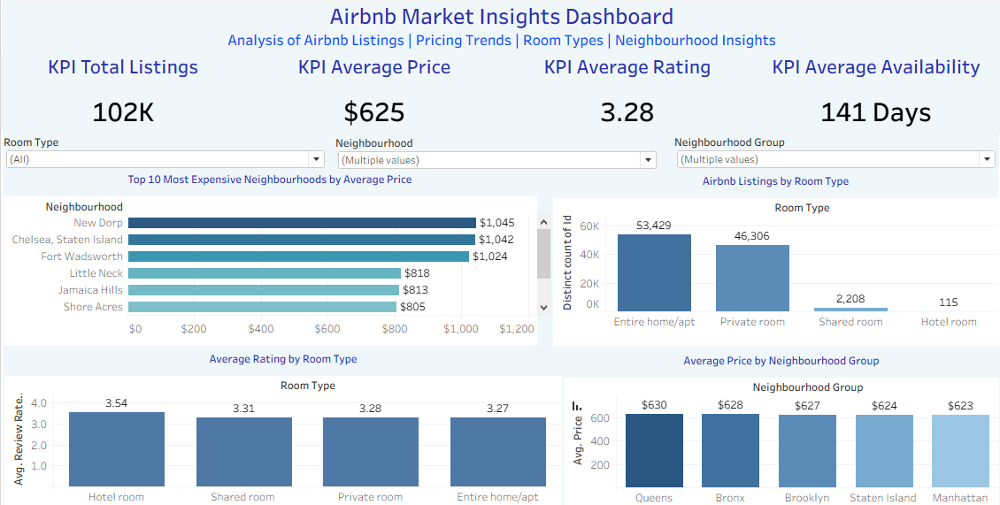

# 🏡 Airbnb Market Insights Dashboard

## 📌 Overview

An end-to-end data analytics project using the Airbnb Open Dataset to analyze pricing patterns, room-type distribution, property availability, booking policies, host-related attributes and customer ratings.

The project combines **Excel for data cleaning, SQL for business analysis, and Tableau for interactive visualization**, transforming raw Airbnb listing data into structured insights and business-oriented recommendations for the short-term rental market.

---

## 🎯 Objective

The objective of this project was to analyze Airbnb listing data to identify patterns in **pricing, accommodation types, availability, booking policies and customer ratings**, and translate these findings into actionable business insights that can support more informed pricing and listing strategies.

---

## 🛠️ Tools & Technologies

* **Excel** — Data cleaning and preparation
* **SQL / SQLite** — Data analysis and business queries
* **Tableau** — Interactive dashboard and data visualization

---

## 📁 Dataset

The project uses the **Airbnb Open Dataset from Kaggle** as the original data source.

The raw Airbnb dataset was cleaned and prepared using **Microsoft Excel** before being imported into SQLite for SQL-based analysis and Tableau for visualization.

The cleaned dataset is included in the repository as a **ZIP file due to the large dataset size and GitHub file-size limitations**.

---

## 📊 Key Analysis Areas

* Pricing Trends Across Neighbourhoods
* Top 10 Most Expensive Neighbourhoods
* Neighbourhood Group Pricing
* Room Type Distribution and Ratings
* Host Identity Verification
* Service Fee Distribution
* Instant Booking and Cancellation Policies
* Property Availability
* Minimum-Night Stay Patterns
* Review Rating Distribution

---

## 🔄 Project Workflow

1. Cleaned and prepared the raw Airbnb listing dataset using Excel.
2. Handled missing and inconsistent values while preserving meaningful missing information where appropriate.
3. Imported the cleaned dataset into SQLite for exploratory and business-focused SQL analysis.
4. Analyzed pricing, room types, availability, booking policies, minimum-night requirements, host attributes and review ratings.
5. Derived business insights and recommendations from the SQL analysis.
6. Built an interactive Tableau dashboard containing KPIs, analytical charts and filters.

---

## 📈 Key Insights

* **Entire Home/Apt** listings accounted for **52.35%** of all properties, while **Private Rooms** represented **45.37%**, making them the dominant accommodation types in the dataset.
* **New Dorp** and **Chelsea, Staten Island** were among the highest-priced neighbourhoods by average listing price, highlighting substantial pricing variation across individual neighbourhoods.
* Approximately **34K listings** fell into the **High Availability** category, while the analysis also identified a substantial number of properties with zero availability.
* **Short Stay** listings accounted for approximately **57K properties**, making short-stay accommodation the largest minimum-night category in the analysis.
* Customer ratings were primarily concentrated between **3 and 5 stars**, with **5-star ratings** representing the largest rating category.
* Instant booking was relatively balanced between listings that allow and do not allow instant booking, while a small portion of records contained unavailable booking-status information.
* **Moderate cancellation policies** represented the largest category among the major cancellation-policy options.

---

## 💡 Business Recommendations

* Use **neighbourhood-level pricing patterns** to develop competitive pricing strategies for different locations.
* Monitor properties with high availability and evaluate pricing, amenities and booking policies to identify opportunities to improve listing performance.
* Consider flexible booking and cancellation policies where appropriate to improve the attractiveness of listings.
* Maintain strong service quality and guest experience to support higher customer ratings.
* Use room-type and minimum-night patterns to understand the accommodation segments with the strongest market representation.
* Compare pricing against similar listings within the same neighbourhood before making pricing decisions.

---

## 📂 Project Files

| File                                    | Description                                                             |
| --------------------------------------- | ----------------------------------------------------------------------- |
| `Airbnb_Analysis.sql`                   | SQL queries used for data analysis and business insights                |
| `Cleaned_Airbnb_Dataset.zip`            | Cleaned Airbnb listing dataset prepared using Excel                     |
| `Airbnb_Market_Insights_Dashboard.twbx` | Tableau workbook containing the interactive dashboard                   |
| `Airbnb_Market_Insights_Dashboard.png`  | Static preview of the Tableau dashboard                                 |
| `Raw_Airbnb_Dataset.xlsx`               | Original Airbnb dataset used as the starting point for data preparation |

---

## 📊 Tableau Dashboard

The interactive Tableau dashboard provides a consolidated view of Airbnb listing characteristics and includes:

* Total Listings KPI
* Average Price KPI
* Average Rating KPI
* Average Availability KPI
* Top 10 Most Expensive Neighbourhoods
* Room Type Analysis
* Average Rating by Room Type
* Average Price by Neighbourhood Group
* Interactive filters for Room Type, Neighbourhood and Neighbourhood Group

---

## 📸 Dashboard Preview

<p align="center">
  
</p>

---

## 🧠 Skills Demonstrated

* Data Cleaning
* Exploratory Data Analysis
* SQL Querying
* Business Analysis
* Data Visualization
* Tableau Dashboard Development
* KPI Development
* Business Insight Generation
* Data-Driven Recommendations

## 📌 Conclusion

This project demonstrates an end-to-end data analytics workflow, from cleaning and preparing raw Airbnb listing data in Excel to performing SQL-based analysis and developing an interactive Tableau dashboard.

The analysis highlights key patterns in pricing, accommodation types, availability, booking policies and customer ratings. These insights can help support more informed pricing, listing and operational decisions within the short-term rental market.

---

## 🔗 Repository

This repository contains the cleaned dataset, SQL analysis, Tableau workbook and dashboard preview for the Airbnb Market Insights project.

### Clone the Repository

To clone this repository locally, run:

```bash
git clone https://github.com/hafsa-ali-data-analyst/airbnb-data-analysis.git
