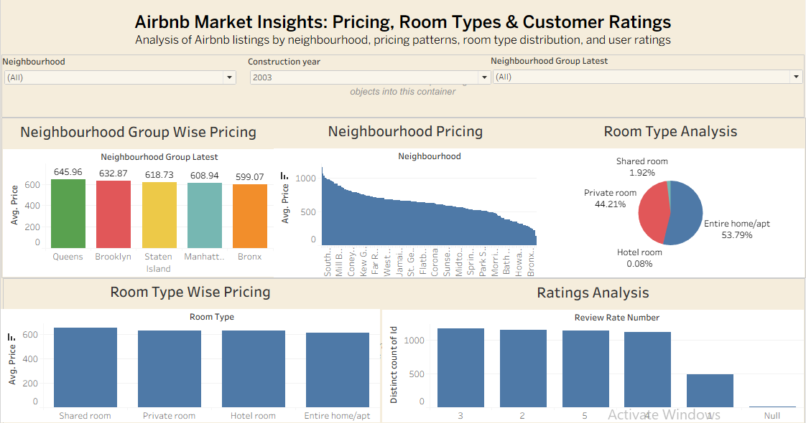

# 🏡 Airbnb Data Analysis

### 📌 Overview
Analyzed the Airbnb Open Dataset using Excel, SQL (SQLite), and Tableau to uncover insights into pricing trends, room-type preferences, booking patterns, host behavior and property availability. Developed an interactive dashboard and generated data-driven recommendations to support decision-making in the hospitality and short-term rental industry.

---

### 🎯 Objective
The objective of this project was to identify key factors influencing Airbnb pricing, occupancy and customer preferences, and to translate raw listing data into actionable business insights that could support revenue optimization, inventory planning and customer experience improvements.

---

### 🛠️ Tools & Technologies
- Excel (Data Cleaning)
- SQL / SQLite (Data Analysis)
- Tableau (Data Visualization)

---

### 📊 Key Analysis Areas
- Pricing Trends Across Neighbourhoods
- Room Type Popularity
- Host Behaviour & Guest Activity
- Booking Patterns & Availability
- Cancellation & Instant Booking Policies
- Review Rating Analysis

---

### 🔄 Project Workflow
1. Cleaned and prepared raw Airbnb listing data using Excel to improve data quality and consistency.
2. Imported the cleaned dataset into SQLite for exploratory and business-focused analysis.
3. Analyzed pricing trends, room-type distribution, availability patterns, customer ratings and booking policies using SQL.
4. Derived actionable insights and business recommendations from query results.
5. Built an interactive Tableau dashboard to visualize KPIs, trends and key findings.

---

### 📈 Key Insights

- Entire Home/Apt listings accounted for **52.35%** of all properties, while Private Rooms represented **45.37%**, making them the dominant accommodation types.
- Average listing prices varied across neighbourhood groups, ranging from approximately **$545–$630**, with premium neighbourhoods maintaining the highest pricing levels.
- Nearly **34K listings** fell into the High Availability category, highlighting opportunities to improve occupancy and booking conversion rates.
- Short-stay accommodations dominated the platform with approximately **57K listings**, significantly outnumbering medium- and long-term stay properties.
- Customer ratings were primarily concentrated between **3 and 5 stars**, with 5-star listings receiving the highest review activity.
- Instant booking and cancellation policy preferences varied across hosts, reflecting different occupancy and pricing strategies.

---

### 💡 Recommendations

- Implement dynamic pricing strategies based on neighbourhood demand, room type performance and customer preferences.
- Improve occupancy rates by optimizing availability management and offering flexible booking options.
- Focus on maintaining high customer ratings through enhanced guest experience and service quality.
- Utilize stay-duration and booking trends to support revenue optimization and inventory planning decisions.
- Monitor high-availability properties and introduce targeted pricing or promotional strategies to improve booking performance.

---

### 📂 Files Included
- `airbnb_data_analysis.sql` → SQL queries and insights
- `cleaned_airbnb_data.csv` → Cleaned dataset
- `raw_airbnb_data.xlsx` → Raw dataset
- `Airbnb_Insights_Dashboard.twbx` → Tableau dashboard

---

## 📂 Cleaned Dataset

The cleaned Airbnb dataset is provided as a ZIP file due to file size limitations on GitHub.

### Steps to Access
1. Download the ZIP file  
2. Extract the contents  
3. Open the CSV file in Excel or any data analysis tool
   
---

### 📊 Dashboard
The Tableau dashboard provides interactive visualizations for pricing, availability, room types, booking trends and customer behavior analysis.

---

### 📸 Dashboard Preview

  

---

### ✅ Conclusion
This project demonstrates an end-to-end data analytics workflow involving data cleaning, SQL-based business analysis, insight generation, and interactive dashboard visualization. The analysis identified key pricing, occupancy, and customer behavior trends, highlighting opportunities for revenue optimization and data-driven decision-making within the short-term rental market.
